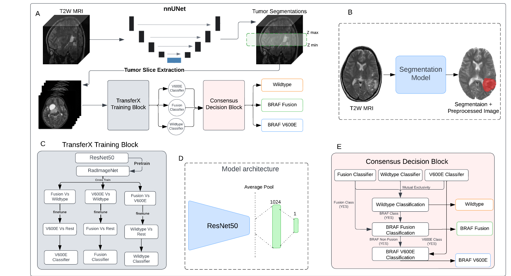

# BRAF Subtype Mutation CLassification 
> This repository contains the implementation of the scan-to-prediction pipeline for non-invasive molecular subtype classification from paper [link here]  .




---

## Table of Contents
- [Installation](#installation)
- [Usage](#usage)
- [Features](#features)


---

## Installation
The project works on two anaconda environments for segmentation code and classification code respectively.
Use this command for installing the anaconda environment for the segmentation code
```shell
cd BRAF_Classification/aidan_segmentation/nnUNet_pLGG/environment.yml
conda env create -f environment.yml
```
After installing the environment for segmentation, insall the environment for 
the classification code using this command. 
```shell
conda env create -f 2d_approach.yml
```

## Usage 
The pipeline process as a single T2W nifti iamge at once. To run the pipeline on an image, put the raw unprocessed nifti image in the src_ip_dir folder. 
```shell 
cd BRAF_Classification/aidan_segmentation/nnUNet_pLGG/src_ip_dir
```
once the image is loaded in the directory the pipeline can be ran by the following command 
```shell
./pipeline.sh
```
Classification output will be printed on the terminal screen along with the running logs. 


